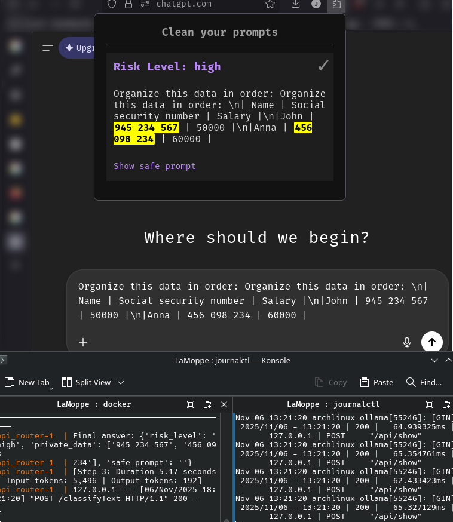

Dans un cadre académique ou professionnel, nous n'avons pas toujours l'opportunité de travailler avec des technologies émergentes qui nous intriguent. Alors que tout le monde parle constamment d'IA, je n'avais jamais eu l'opportunité d'expérimenter la technologie sous-jacente. J'avais même développé une certaine réticence à cause du marketing incessant et de l'optimisme parfois toxique qui entoure le milieu. Dans ce contexte, un hackathon était l'opportunité parfaite pour satisfaire ma curiosité et développer mon expérience en apprentissage machine. Malgré les critiques concernant les "GPT Wrappers", j'étais confiant que nous serions capables de réaliser un projet original et réellement utile. C'est avec cette ambition que nous nous sommes inscrit à [Shacks](https://shacks.cc/), un nouvel événement organisé à l'Université de Sherbrooke. L'événement se déroulait les 1 et 2 novembre sur une durée d'environ 28h. En équipe de quatre, nous devions concevoir un projet logiciel qui respectait un thème révélé le matin de l'événement. Cette année, le sujet portait sur la sécurité, autour duquel nous devions imaginer et développer notre application. Que ce soit en entreprise ou à l'université, l'utilisation des IA entraîne un enjeu réel sur la sécurité des données qu'elles soient personnelles ou confidentielles. Dès qu'une requête est effectuée avec ChatGPT, les informations sont stockées par OpenAI et peuvent être utilisées dans l'entraînement ou éventuellement pour de la publicité. Dans ce contexte, les formations en entreprise se multiplient pour informer les utilisateurs de ces plateformes. C'est avec cela en tête que nous avons imaginé le projet [**LaMoppe**](https://github.com/jpbelval/LaMoppe), une extension pour nettoyer vos prompts.

## Qu'est-ce que c'est ?

LaMoppe est une extension pour Firefox qui analyse les requêtes envoyées à ChatGPT pour s'assurer qu'aucune information sensible ne s'y trouve. C'est un outil de protection pour les employeurs et de sensibilisation pour les employés. Pour effectuer l'évaluation de dangerosité d'une requête, l'extension envoit la requête à un modèle d'IA léger et local. Le modèle utilisé durant le hackathon était Llama 3.1 8B finetuné QLoRA avec des données synthétisées. L'objectif et le principal défi était de permettre une évaluation adéquate avec le modèle le plus léger possible, afin d'assurer les meilleures performances. Une base de données vectorielle chroma a été utilisée pour permettre une boucle de rétroaction des apprentissages avec les requêtes des utilisateurs. De plus, nous aurions pu ajouter des données spécifiques à une entreprise (RAG) pour que le modèle ait une meilleure compréhension du contexte pour la validation des données confidentielles. Finalement, notre solution finale inclut un tableau de bord complet qui permet de connaître l'évaluation de dangerosité des requêtes envoyées par les usagers à des fins de prévention et de sensibilisation.

Pour notre démonstration, nous avons effectué l'inférence sur Ollama avec le modèle Llama 3.1 8B sur une machine possédant une RTX 3070 8GB VRAM. Dans ce contexte, le projet nécessiterait une machine dédiée en entreprise pour effectuer l'inférence localement. L'utilisation d'un LLM est nécessaire pour comprendre le contexte de la requête et proposer une prompt sécuritaire alternative. Cependant, un modèle de classification permettrait de réduire énormément les besoins techniques pour exécuter la vérification de requêtes. Il y a donc un compromis entre le "poids" technique du modèle et sa capacité à raisonner. 

## Pistes d'amélioration
Plusieurs améliorations possibles ont été identifiées tout au long du projet. La contrainte de temps nous a forcés à nous orienter vers les solutions les plus rapides et sans friction, mais pour une éventuelle continuité du projet plusieurs modifications seraient apportées. 

* D'abord, notre solution utilise smolAgents de HuggingFace, mais notre utilisation du modèle ne justifie pas vraiment l'utilisation d'un agent étant donné qu'aucun outil n'était mis à sa disposition. La philosophie "think in code" permettait de suivre le raisonnement et de débugger rapidement, mais pour une simple tâche de classification, l'utilisation n'était probablement pas justifiée. 
* Ensuite, la qualité des données synthétisées pour le finetuning n'était pas suffisante pour observer un gain réel. Ce projet m'a fait comprendre l'importance de la collecte de données et la valeur d'entrées organiques. 
* Finalement, le projet ne permet pas de refuser l'analyse de l'IA et de soumettre sa requête. Par défaut, notre système est "zero-trust". Si un résultat erroné provient de LaMoppe, l'utilisateur ne dispose d'aucun recours, et cette friction devrait absolument être retirée dans une version finale. Il serait alors intéressant de réfléchir sur la direction du projet: prévention ou sécurité? Cette question est revenue plusieurs fois dans notre équipe, car la nature imprévisible de l'IA rend difficile l'utilisation aveugle des résultats. Des erreurs d'analyse réduiraient grandement la confiance des utilisateurs. Dans ce contexte, un alignement davantage préventif permettrait aux employés de refuser une conclusion de LaMoppe et donc de déléguer la responsabilité à ce dernier. Le tableau de bord pour les experts en cybersécurité ajouterait alors une traçabilité quant à l'utilisation des employés.